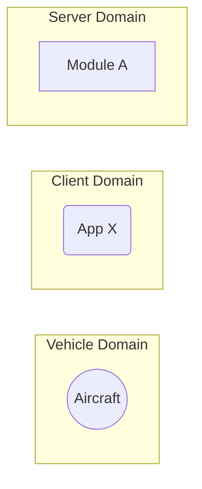

# Flight Ops - Software Design Document (SDD)

## Overview

This document details the software implementation of the Flight Ops module.

This process is responsible for communicating with active aircraft. The primary responsibility of this module is to recieve and store flight telemetry in real time. Will also broadcast this telemetry for live monitoring.

TODO: Discuss [Streamr](https://streamr.network/) as an option for this module.

Attribute | Description
--- | ---
Status | Draft

## Related Documents

Document | Description
--- | ---
[Concept of Operations (CONOPS)](./FIXME) | Overview of the scope and duties of this module.
[Requirements & User Stories](./FIXME) | Requirements and user stories for this module.

## Location

This module runs as a process in the Arrow server backend.

## Module Attributes

Attribute | Applies | Explanation
--- | --- | ---
Safety Critical | Yes | Active flight data may be used for manual control or by air traffic control.
Realtime | Yes | Similar rationale to "Safety Critical".

## Global Variables

**Statically Allocated Queues**

FIXME

## Interfaces

For a refresher of the processes in the Arrow backend, please see the [top level README.md](../README.md).

FIXME description of the graph.

### REST API

FIXME

## Logic 

### Initialization

FIXME 

### Control Loop

FIXME

### Cleanup

FIXME
