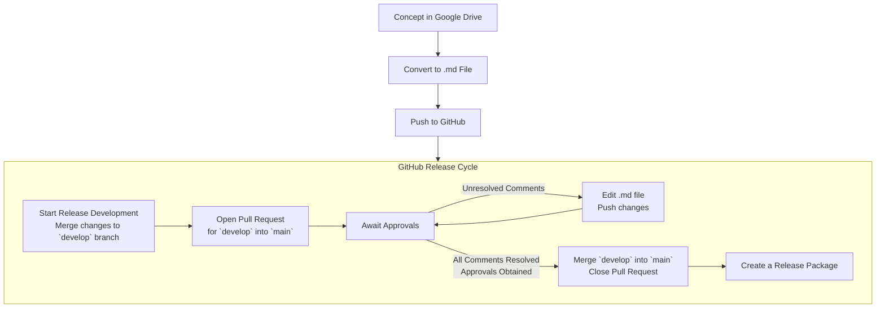
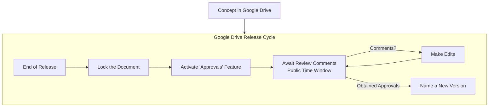

# SE Management Plan (SEMP)

### Metadata

| Item | Description |
| --- | --- |
| Maintainer(s) | A.M. Smith |

## Terms

Terms | Descriptions
--- | ---
Core Team | Members of the [GitHub Team](https://github.com/orgs/Arrow-air/teams) relevant to product
Release/Version | "Release" and "Version" are used interchangeably in this document

## Overview

The Systems Engineering Management Plan (SEMP) is a guide to managing technical
processes and documentation.

This document outlines:
- Technical processes
- Creation, modification, and review of technical
documentation
- Review processes

## :busts_in_silhouette: Code Collaboration

### :muscle: Contributing

The process of contributing to a GitHub repository is well documented online.
1. Make a copy of the repository on the local machine
2. Initialize a "branch" using git
    - A branch is a set of changes with a label, e.g. `readme-updates`
3. Edit the relevant document(s)
4. "Commit" the changes
	- A commit is a record of a change labeled with a unique number (hash)
    - A branch may have several commits
5. "Push" (send) commits to GitHub

At this stage, GitHub now has at least three branches, or sets of code:
- `main`: The stable source code of the latest release
- `develop`: Code that will eventually become the next release
- The contributor's branch (e.g. `readme-updates`)

Can I merge my branch straight to `main` or `develop`?
- The `main` and `develop` branches only allow merges from Pull Requests.
  - A PR is an official request to merge code into a branch.
- To merge the new changes into `develop`, the contributor creates a new PR for
  their branch.
- Other collaborators must review the code, make comments, and give their
approvals prior to merging the branch.

The official [Arrow Developer Guide](https://www.arrowair.com/docs/contributing/devguide) describes this process in specifics.

### :bookmark: Creating a Release
Creating a new release is a trivial action in the GitHub interface and is already [well documented](https://docs.github.com/en/repositories/releasing-projects-on-github/managing-releases-in-a-repository).

When?
- After end-of-release reviews are completed and the `develop` branch is merged into `main`, the Core Team will create a new release from the `main` branch.

What's in a Release?
- See [Rust's releases page](https://github.com/rust-lang/rust/releases) for examples
- A compressed file containing a snapshot all source code
- The unique identifier of the final commit in the release
- A description of major and minor changes since the last release
- A timestamp
- :exclamation: Other file attachments relevant to the release
	- Exported spreadsheets or PDFs from Google Drive whose versions are compatible with this release of the source code.
	- e.g. Requirements Matrix v.1.0.1 (spreadsheet) is implemented by this release of source code

## :seedling: Document Life Cycle

### :bulb: Concept Phase

Every document has a concept phase.

The conceptual phase starts with a template, outline, or blank document created
in [Google Drive](https://www.google.com/drive/).
- This browser-based software enables concurrent edits to a document by numerous editors.
- Allows comments with the
  [Comment](https://support.google.com/docs/answer/65129?hl=en&co=GENIE.Platform%3DDesktop)
  feature, which does not edit the document itself.

Prior to a "first" release, there is considerable churn in document contents
that do not need to be tracked. This includes adding and removing paragraphs,
tweaking sentences, and editing for tone.

When the first version of the document is close to finalized, the primary
author will decide the final format and home of the document.
- Markdown format, tracked by a [version control system](https://en.wikipedia.org/wiki/Version_control)
- Google Doc/Spreadsheet in Google Drive

### :pencil: Markdown Documents (with Git)

#### Overview

In this approach, a document is written in
[Markdown](https://www.markdownguide.org/getting-started/) and is stored in a
remote (cloud) repository.

Advantages of writing in Markdown:
- Plaintext file is easy to review
- Renders to a uniform, readable format
- Renders UML diagrams, code snippets

Changes to the document are tracked by [git](https://git-scm.com/), a **version
control system** (VCS) software. Files are hosted by [GitHub](https://github.com).

What does Git do?
- View a file's history of "commits", or changes
    - [Example of Commit History](https://github.com/Arrow-air/website/commits/staging)
- Merge multiple user's branches (history of changes) together
- Undo commits
- Assign unique integer identifiers to a commit

What is GitHub?
- Online service for hosting git repositories
- Manage access to source code
- Hold public code reviews
- Deploy release (versioned) packages of code

#### Which Documents?

If a change to a document results in a change in code, that document should be
tracked in the same git repository.

In our case, these include:
- Software Design Documents (SDD)
    - Describes how the code works
- Interface Control Documents (ICD)
    - Describes inputs and outputs of code

#### Collaboration

Prior to Release/Version One: [Concept Phase](#-concept-phase)

Collaboration on a version controlled document is the same as collaboration on source code, which is outlined [here](./#code-collaboration).

#### Edit Permissions

Anyone can make a Pull Request (see [Collaboration](#collaboration)).

The code remains in an isolated branch and will not be merged into the `develop` branch without approvals from the Core Team.

#### Release Cycle

##### Version Draft

All branches seek to merge with the `develop` branch.

The `develop` branch is current development, or the 'Draft' set of changes.

##### Version Review

Multiple Pull Requests may be merged into `develop` throughout the course of a release.

At the end of a release cycle, a Pull Request is created to merge the `develop` branch into `main`. 

This is the final opportunity for collaborators to review the documents and make comments. This is also where a [pre-release checklist](checklists/prerelease.md) is addressed.

At this stage, supplementary presentations and video may accompany source code and documentation.

When the review completes and the pre-release checklist is complete, the `develop` branch is merged into `main`.

##### Creating a Release

Markdown documents in a GitHub repository will be packaged with source code when a release is created. Each document does not need its own document version.

Creating a release in GitHub is discussed in [Code Collaboration](#code-collaboration).

### :bar_chart: Google Docs/Sheets (in Google Drive)

#### Overview

In this approach, a document is stored and version-controlled in Google Drive.

Advantages of writing documents in the Google ecosystem:
- Increased control over document formatting
	- margins, colors, fonts, text sizes, alignment, and so on
- "Version" feature
  - Create timestamped snapshots of the document
- "Comment" feature
	- Adds reviewer comments without editing the document itself
- "Approvals" feature for reviews
- Exportable to numerous formats

#### Which Documents?

Documents hosted in the Google Drive include:
- Those relying extensively on visual media (graphics, charts, video embeds)
- Spreadsheets
- Documents targeted toward partners, investors, and the general public
    - These documents sometimes require greater control over presentation than Markdown allows

Specific documents that these include:
- User Story Matrices
- Requirement Matrices
- Concept of Operations (CONOPS) Documents
- Roadmaps

#### Collaboration

Collaboration on a document in Google Drive is discussed in the [Concept Phase](#concept-phase).

#### Edit Permissions

Anyone with a link can view the document.

Only members of a Core Team have edit permissions.

#### Release Cycle

##### Version Draft

Edits may be made to the Google Drive document until the end of a release.

##### Version Review

:exclamation: *A review should occur if changes to a document have been made since the prior release.*

Review of a Google Drive document is possible through the [Approvals](https://support.google.com/drive/answer/9387535) feature.

The document should be locked at this time. The primary author shall make a public request for reviewers to leave comments through the "Approvals" feature.

The time window for reviewing the document shall also be public.

This is the final opportunity for collaborators to review the document and make comments. This is also where a [pre-release checklist](FIXME) is addressed, including adherence to the [Writing Style Guide](https://www.arrowair.com/docs/contributing/styleguides/writing).

At this stage, supplementary presentations and video may accompany the documentation.

When the all approval comments are complete, it is time to 

##### Creating a Release

It is possible to [name a new version](https://support.google.com/a/users/answer/9331169?hl=en#6.4) of a document in Google Drive.

Version naming should follow [semver guidelines](https://semver.org/).

:exclamation: Version for documents outside of a GitHub repository may not match the version of the GitHub release.

## :bookmark_tabs: Documents

### :globe_with_meridians: Locations

Here we define the complete list of product documents produced by Arrow.

| Document | Where? | Why? |
| ---- | ---- | ---- |
| :thought_balloon: Concept of Operations (CONOPS) | Drive | Commonly viewed by stakeholders. Contains graphs, images.
| :running: User Stories | Drive | Spreadsheet
| :microscope: Requirements | Drive | Spreadsheet
| :triangular_ruler: Software Design Document (SDD) | GitHub | Tightly linked to code. Markdown supports sequence diagrams.
| :mailbox_with_mail: Interface Control Document (ICD) | GitHub | Tightly linked to code.
| :heavy_check_mark: Verification & Validation (V&V) Document | GitHub | Code Snippets
| :diamond_shape_with_a_dot_inside: Configuration Management (CM) Guide | GitHub | Code Snippets
| :video_game: Human Systems Integration (HSI) Document | Google Drive | Lots of Pictures

### :black_nib: Descriptions

#### :thought_balloon: Concept of Operations (CONOPS)

A high-level overview of a module or product.

Defines the scope of development, support, and testing.

Relevant:
- [Arrow CONOPS Template](https://docs.google.com/document/d/1AhwyUmMH1rbmqMcTd1EyFIDcn-ItmaPxc7lKdZSf-q8/edit?usp=sharing)
- [NASA CONOPS Template](https://www.nasa.gov/seh/appendix-s-concept-of-operations/)

#### :running: User Stories

User stories are statements of action, intent, or desire from a user of the product.

User stories have the following attributes:
- **UID**
  - A unique integer identifier
  - e.g. 0x123412ac
- **Label**
  - An easier name for this user story
  - e.g. US-PILOT-0001
- **Primary Text**
  - "As a passenger, I want..."
- **Rationale**:
  - Why this is worded the way it is, why it exists

UID | Label | Primary Text | Rationale
--- | --- | --- | --- |
0x0234abcd | US-CARGO-0001 | As a passenger, I want to... | etc.

#### :microscope: Requirements

Requirements are "shall" or "must" statements specific to implementation.

Requirements have the following attributes:
- **UID**
  - A unique integer identifier
  - e.g. 0x0ABCD123
  - Never changes, allows Label to be changed
- **Label**
  - Easier name for this requirement
  - e.g. "REQ-SCHED-0001"
- **Primary Text**
  - *"The module shall..."*
- **Rationale**
  - Why this requirement is needed
- **Notes**
  - Additional notes by developers or testers
- **Parent**
  - All requirements (except at the top level) must have a parent requirement
  - e.g. "REQ-0001"
- **Children**
  - Any requirements that extend from this requirement
- **Linked User Story**
  - What user stories is this requirement addressing?

*Example*:

UID | Label | Primary Text | Rationale | Parent | Children | User Stories
--- | --- | --- | --- | --- | --- | --- 
0x0234abcd | REQ-0005 | The module shall... | Because... | REQ-0001 | REQ-0006 REQ-0020 | US-CARGO-0001

Relevant:
- [NASA How to Write a Good
Requirement](https://www.nasa.gov/seh/appendix-c-how-to-write-a-good-requirement/)

#### :triangular_ruler: Software Design Document (SDD)

Document containing:
- State Machine Sequence Diagrams
- Explanation of libraries
- Explanation of global variables
- Explanation of memory allocations

Relevant:
- [Arrow Markdown SDD Template](./templates/sdd.md)

#### :heavy_check_mark: Verification & Validation (V&V) Document

Document detailing:
- Scope of Testing
- Testing Procedure(s)
- How Tests are Kept Up-To-Date
- Frameworks Used

Relevant Documentation:
- [Arrow Markdown V&V Template](./templates/vnv.md)
- [V&V Wiki](https://en.wikipedia.org/wiki/Software_verification_and_validation)

#### :mailbox_with_mail: Interface Control Document (ICD)

This document details:
- Inputs and Outputs of a Module
- Packet Formats
- Frameworks and Libraries

Relevant:
- [Arrow Markdown ICD Template](./templates/icd.md)

#### :diamond_shape_with_a_dot_inside: Configuration Management (CM) Document

Procedures in response to external factors, such as:
- Increases in server costs
- Sudden loss of service
- Change in available resources
- Customer changes (new, lost)

Relevant:
- [NASA CM Plan Outline](https://www.nasa.gov/seh/appendix-r-plan-content)

#### :video_game: Human Systems Integration (HSI) Document

Document concerning the human element:
- Operators
  - Who They Are
  - Roles & Responsibilities
- How to Operate, Maintain, and Support the System
- Safety Considerations

Relevant:
- [NASA HSI Outline](https://www.nasa.gov/seh/appendix-r-plan-content)