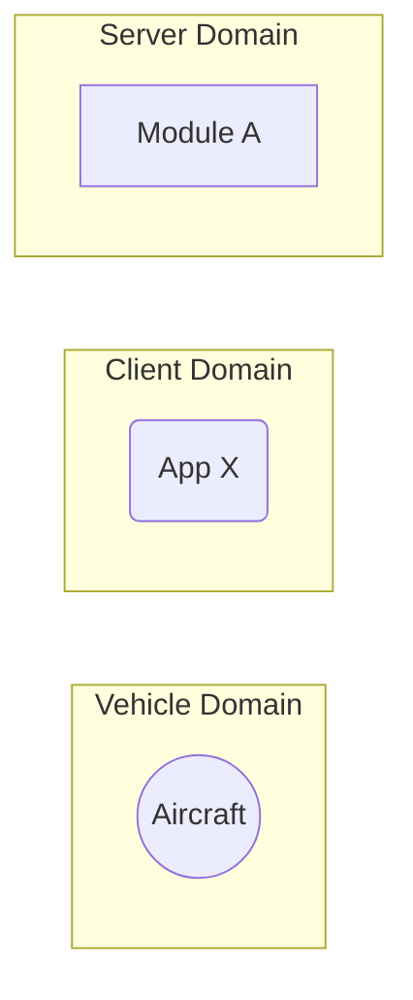

# Playback - Software Design Document (SDD)

## Overview

This document details the software implementation of the Playback utility.

This process is responsible for FIXME

Desirement | Description
--- | ---
Display Vertiports, Pads | "Nodes" are pads
Dispay aircraft in transit, smoothly | No "jumping" along points between pads to display movement.
Display the customers, indicate the number of waiting customers | Should be visually obvious when a vertiport is crowded
Time rate adjustment | 1x, 5x, 100x speed

Framework | Description
--- | ---
[Veroviz](https://veroviz.org/)
[NetworkX](https://networkx.org/)
[PyVis](https://pyvis.readthedocs.io/en/latest/)
[QGis Geospatial Simulation](https://plugins.qgis.org/plugins/geospatialsimulation/)
QGIS Isochrones

Attribute | Description
--- | ---
Status | Draft

## Related Documents

Document | Description
--- | ---
[Concept of Operations (CONOPS) (FIXME)](./FIXME) | Overview of the scope and duties of this module.
[Requirements & User Stories (FIXME)](./FIXME) | Requirements and user stories for this module.

## Location

FIXME

## Module Attributes

Attribute | Applies | Explanation
--- | --- | ---
Safety Critical | ? | 
Realtime | ? |

## Global Variables

**Statically Allocated Queues**

FIXME

## Logic 

### Initialization

FIXME 

### Control Loop

FIXME

### Cleanup

FIXME

## Interfaces

For a refresher of the processes in the Arrow backend, please see the [top level README.md](../README.md).

FIXME description of the graph.

### REST API

FIXME