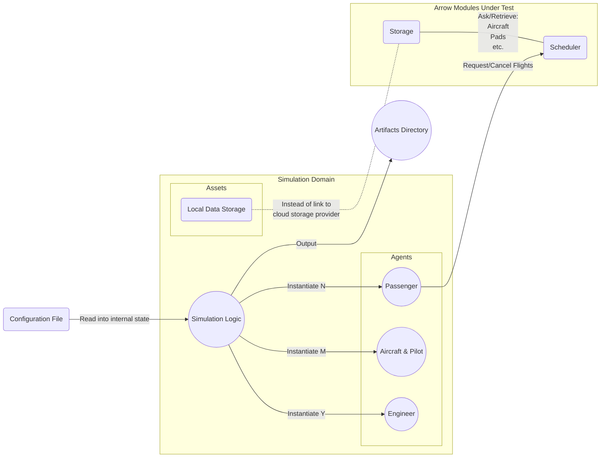

# Simulation - Software Design Document (SDD)

FIXME Generate fake customers of various types who are interacting with the Arrow rideshare system. A fake fleet of aircraft in a fictional city, or use an existing city and existing aircraft.

NOTE: The simulation is run locally within a container and does not have any access to real world assets or Arrow backend processes.

The simulation does not have visuals by default. However, it does generate artifacts which can be fed to a visualizer and replayed at adjustable playback speeds.

The simulation may be realtime, depending on the time demands of the processes involved. Processes like the `scheduler` may have a 5 second control loop that cannot be sped up due to complicated algorithms needing time to complete.

## Overview

This document details the software implementation of the simulation and playback utilities.

Attribute | Description
--- | ---
Status | Draft

## Related Documents

Document | Description
--- | ---
[Concept of Operations (CONOPS) (FIXME)](./FIXME) | Overview of the scope and duties of this module.
[Requirements & User Stories (FIXME)](./FIXME) | Requirements and user stories for this module.

## Location

This process is run locally by developers, it does not live in the Arrow backend (servers) and should have no access to live Arrow processes.

## Module Attributes

Attribute | Applies | Explanation
--- | --- | ---
Safety Critical | No | Simulation, no access to real world assets
Realtime | No | Simulation does not have realtime demands

## Global Variables

**Statically Allocated Arrays**

+ Vertiports
+ Pads
+ Aircraft
+ Passengers

## Configuration File

**Attributes**

+ Vertiports
  + Number of pads
  + Restrictions: private residence/business, maintenance, etc.
+ Pads
  + Geographical coordinates (within 1 m) and altitudes
  + Type of pad: Cargo, Passenger, Emergency Only, Backup Only, Maintenance Only
  + Charging capability
+ Aircraft
  + Battery Capacity
  + Battery Discharge Rate per Kg per second
  + Passenger Capacity
+ Flights
  + Length of inspection time
  + Length of loading time
  + FAA Air Corridors or VFR (visual flight rules)
  + Weather conditions on route
  + Allowed to hover for how long
  + Unloading time
+ Passengers
  + Type: Commuter, weekender, etc.
  + Patience level
  + Weight
  + Weight of luggage
  + Random cancellation
  + Random destinations
  + Randomly times out on route selection (passenger leaves app, gets distracted)

The configuration file will declare the type of each of these attributes:
+ Arithmetic type (e.g. U32, float, etc.)
+ Arithmetic type limited to a set of values (e.g. [11, 20, 30, 44])

The configuration file will declare rules for selecting a value for each of these attributes:
+ Random seed
+ Normal distribution curve (e.g. norm(0, 100))
+ etc.

## Logic 

### Initialization

Read the configuration file to instantiate arrays of pads, passengers, and aircraft.

Set config variables to the values in the configuration file.

### Control Loop

Perform the following tasks:
+ Calculate new location of aircraft
+ Update view with location of aircraft, individuals

### Cleanup

FIXME

## Interfaces

For a refresher of the processes in the Arrow backend, please see the [top level README.md](../README.md).

The instantiated processes will read and write to local storage rather than the storage solution the Arrow backend uses. This avoids contamination of real world records.

### REST API

FIXME
